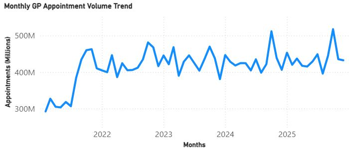
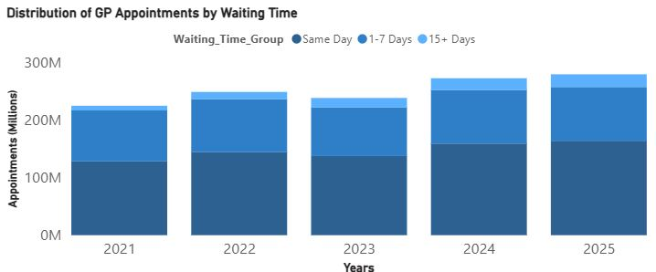

**NHS GP Appointment Data Analysis (England)**

** Project Overview**

This project analyses publicly available NHS GP appointment data to explore patterns in primary care demand across England. The analysis focuses on transforming complex, non-standard reporting tables into a clean analytical dataset and identifying trends that could support operational planning and healthcare service delivery.

Real-world NHS datasets are often distributed in reporting formats rather than analysis-ready structures. This project demonstrates how raw statistical publications can be converted into structured datasets suitable for analysis, insight generation, and future automation.

**Objectives**

- Clean and standardise NHS GP appointment datasets

- Transform reporting tables into analysis-ready format

- Handle multi-sheet Excel files with non-standard headers

- Create reusable data cleaning functions

- Explore appointment activity trends over time

- Apply reproducible analytical workflow principles

**Dataset**

Source: NHS England Open Data
Dataset: Monthly GP Appointment Statistics

The dataset includes:

- Appointment volumes by month

- Delivery type (face-to-face, telephone, etc.)

- National-level operational activity metrics

- Multiple Excel workbooks containing structured reporting tables (e.g., Table 1a)


**🛠 Tools & Technologies**

- Python

- Pandas – data cleaning & transformation

- NumPy – numerical handling

- Jupyter Notebook

- VS Code

- Git & GitHub – version control

```
nhs-gp-analysis/
│
├── data/
│   └── raw/
├── notebooks/
│   └── explore_nhs_data.ipynb
├── src/
│   └── data_cleaning.py
└── README.md
```

# Visualisations

## 1. Appointments Trend Analysis

## Key insights
- Appointment volumes increased significantly between 2021 and 2023 
- A notable demand spike in 2023 suggests periods of heightened service pressure 
- Demand stabilises after 2023 but remains consistently high




## 2. Distribution of GP Appointments by waiting time

## Key observation
- Majority of appointments occur on the same day or within 7 days 
- This suggests strong access to urgent primary care services
- A smaller propordtion fall into longer waiting categories (15+ ays).



**Skills Demonstrated**

- Data cleaning of real-world public sector datasets

- Handling complex Excel reporting structures

- Python-based data transformation

- Analytical problem framing

- Reproducible workflows

- Version-controlled analytical development

**Future Improvements**

- Add forecasting model

- Automate monthly ingestion

- Build Power BI dashboard
